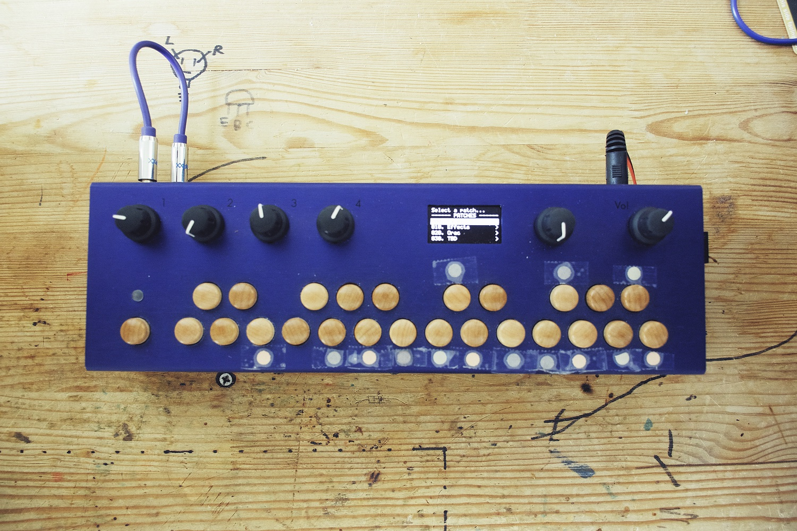
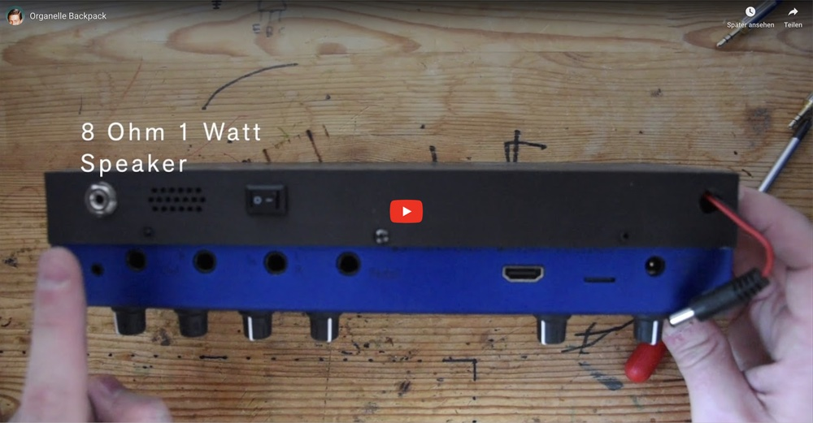
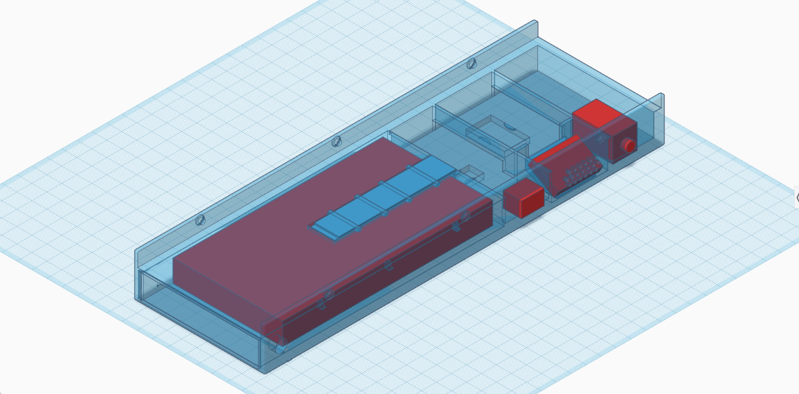
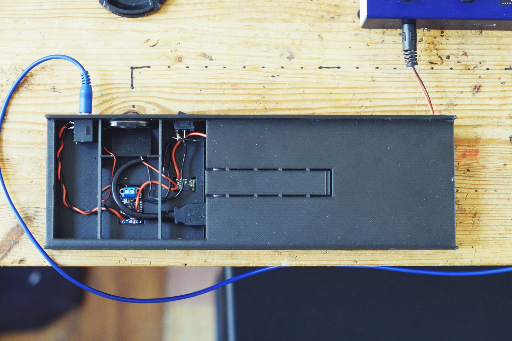
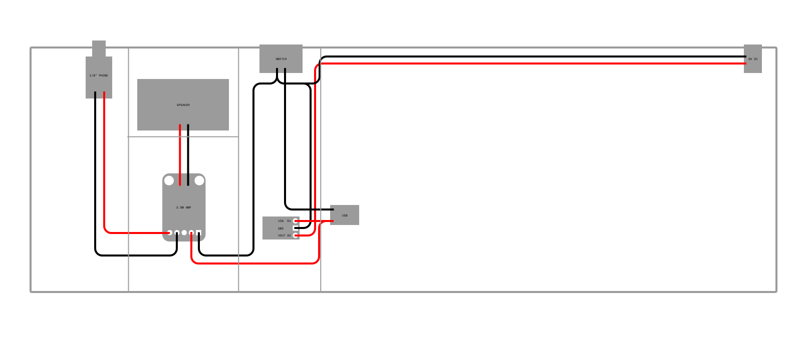

# Organelle Backpack

### A rechargeable battery and speaker attachment for the original [Organelle](https://www.youtube.com/watch?v=DkwYAB6EeFE). So now all of us that own the older version can also join in on the portable fun.

:eyes: Since the photo and video was taken, I've swapped the straight DC plug for a [right angled](https://www.amazon.com/gp/product/B008UZARXW/ref=ppx_yo_dt_b_asin_title_o01_s00?ie=UTF8&psc=1) DC plug.

Here's a brief [video](https://youtu.be/qm4NnYaNKb8) showing the guts of the backpack and the portable goodness.

---

#### Base

- Width `266.8 mm` (`10-1/2 inches`)
- Depth `87 mm` (`3-7/16 inches`)
- Height `28.5 mm` (`1-1/8 inches`)

The base is designed to be 3D printed and only adds an overall `19mm` (`3/4 inches`) to the height of the Organelle. If you don't have access to a 3D printer (public maker space, library, work, friend) you can used a 3rd party service via [Tinkercad](https://www.tinkercad.com/things/ilVILA7wP3c-organelle-backpack/edit), [Thingiverse](https://thingiverse.com/), or wherever you choose. Below are links to various 3D file formats, I used the `STL` file to print mine on a [Markforged Mark Two](https://markforged.com/mark-two/) printer.

:warning: **Heads up** this piece is large-ish and could be quite costly (> $100) to reproduce through a 3rd party printing service.

| Format | File |
| ------ | ---- |
| GLTF | [organelle-backpack.glb](./organelle-backpack.glb) |
| MTL | [organelle-backpack.mtl](./organelle-backpack.mtl) |
| OBJ | [organelle-backpack.obj](./organelle-backpack.obj) |
| STL | [organelle-backpack.stl](./organelle-backpack.stl) |
| Tinkercad | [Organelle Backpack](https://www.tinkercad.com/things/ilVILA7wP3c) |

---

#### BOM

These are the parts you'll need in addition to the 3D printed backpack. I sourced parts from 3 different vendors; [Mouser](https://mouser.com/), [Pololu](https://pololu.com), and [Amazon](https://amazon.com), you might be able to source everything through a different vendor.

 ℹ️ The USB A breakout is optional, as you can see above I simply spliced an old USB cable I had lying around.

| Qty.| Part No. | Description | Price |
| ---- | ---- | ---- | ---- |
| 1  | [3923](https://www.mouser.com/ProductDetail/485-3923) | Adafruit Accessories Mini Oval Speaker - 8 Ohm 1 Watt | $2.43 |
| 1 | [SJ1-3533](https://www.mouser.com/ProductDetail/CUI-Devices/SJ1-3533) | 1/8" Phone Connectors Audio Jacks | $1.59 |
| 1 | [D102J12S215PQA](https://www.mouser.com/ProductDetail/CK/D102J12S215PQA?qs=sGAEpiMZZMtNT9UGfLL4eOd3cDQgL8vMBYotf5dbv78%3D) | Rocker Switches SPST ON-OFF | $2.97 |
| 1 | [2130](https://www.mouser.com/ProductDetail/485-2130) | Adafruit Mono 2.5W Class D Audio Amplifier - PAM8302 | $3.95 |
| 1 | [B008UZARXW](https://www.amazon.com/gp/product/B008UZARXW/ref=ppx_yo_dt_b_asin_title_o01_s00?ie=UTF8&psc=1) | 5.5 x 2.5mm Right Angle DC Power | $1.78 |
| 1 | [U3V12F9](https://www.pololu.com/product/2116) | Pololu 9V Step-Up Voltage Regulator U3V12F9 | $3.95 |
| 1 | [TONV BP1012](https://www.amazon.com/gp/product/B078TFHXVY/ref=ppx_yo_dt_b_asin_title_o02_s00?ie=UTF8&psc=1) | Power Bank 10000 mAh | $9.99 |
| 1 | [B07KXDPT1M](https://www.amazon.com/flashtree-Type-Breakout-Board-2-54mm/dp/B07KXDPT1M/) | 2 Pcs USB 2.0 Type A Male Breakout Board 2.54mm (optional) | $5.99 |
| | | | |
| | | | **Sub-total (no shipping)** |
| | | | $32.65 |

---

#### Wiring

Below is a simplified wiring guide; :red_circle: is positive voltage :black_circle: is negative voltage/ground. You'll need some decent silicon wire (22–28 AWG) to ensure a quality build as well as a soldering iron.

